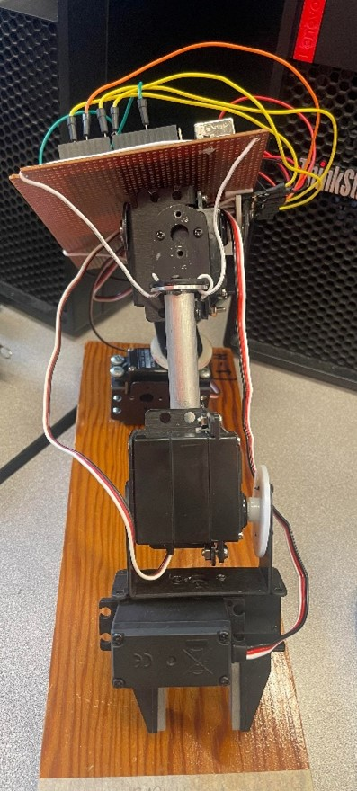
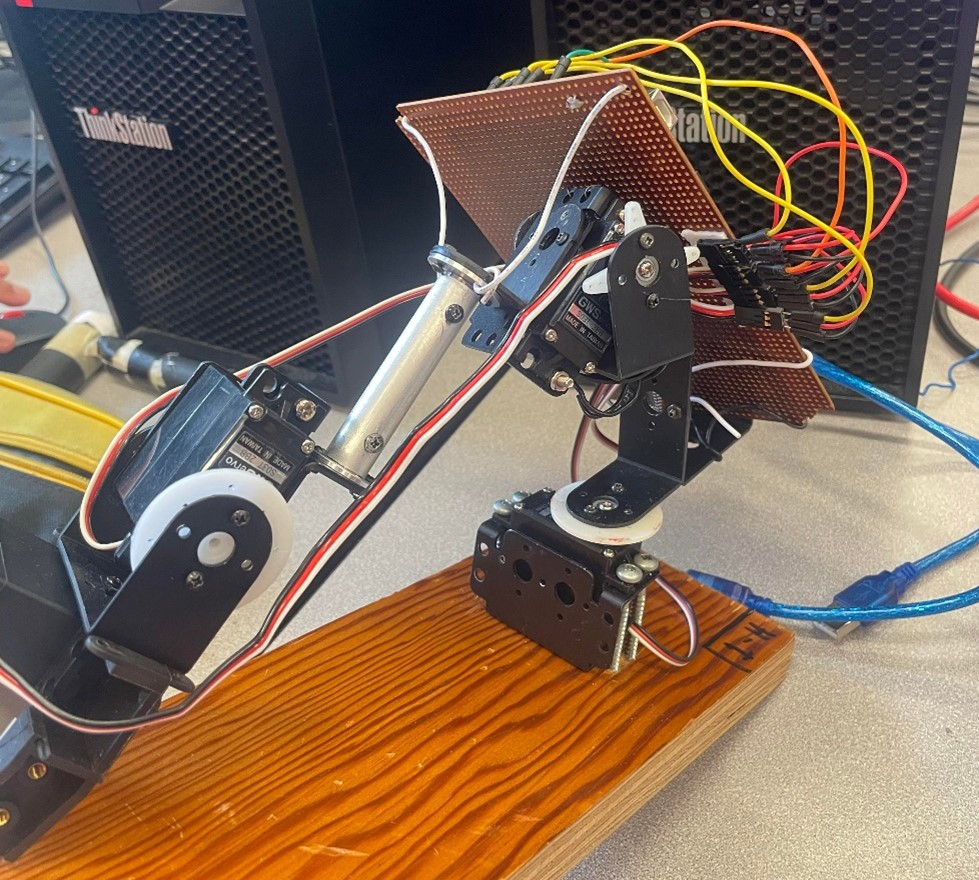
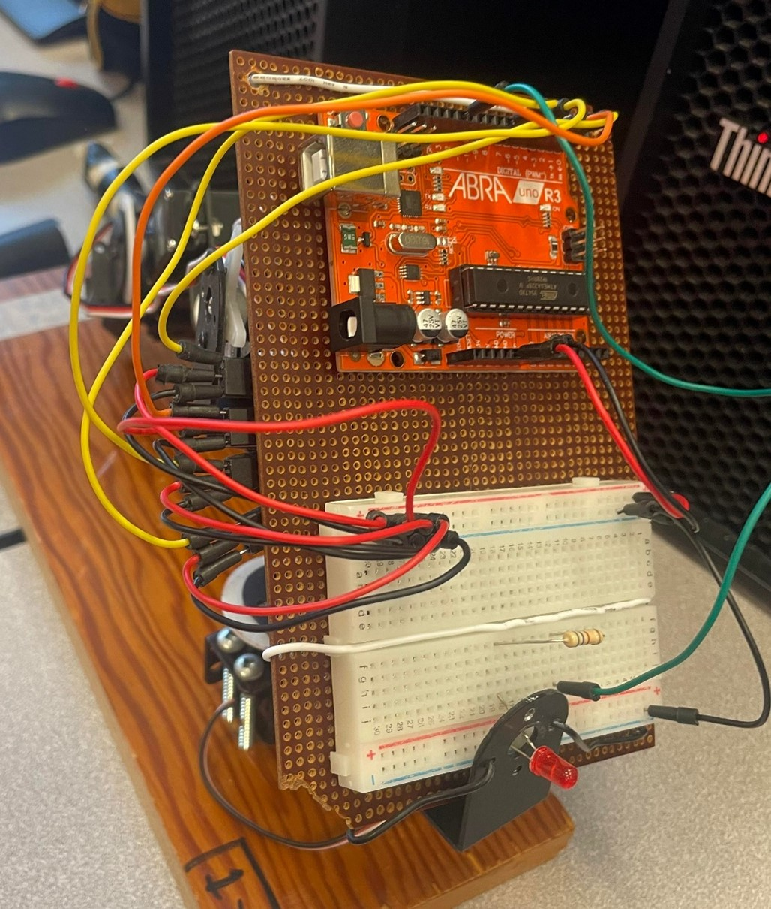

# Bras-robot-3D
Système de contrôle, sans rétroaction, exécutant un déplacement tridimensionnel (3D) par 4 servomoteurs.

# Images
  

# Contrôle :

## « 1,2,3,4 » 
- Pour sélectionner le moteur que vous souhaitez contrôler.

## « A,W »     
- Faire un virage à droite ou vers le haut avec le moteur sélectionné.

## « D,S »     
- Faire un virage à gauche ou vers le bas avec le moteur sélectionné.

# Paramètres du système

|                  | Pin | Position Initiale  | Vitesse /20ms |
| ---------------- | :-: | :----------------: | :-----------: |
| Servo1 (Épaule)  |  2  | 68°                | 1.5°          |
| Servo2 (Coude)   |  4  | 130°               | 2°            |
| Servo3 (Poignet) |  7  | 120°               | 5°            |
| Servo4 (Main)    |  8  | 90°                | 10°           |
